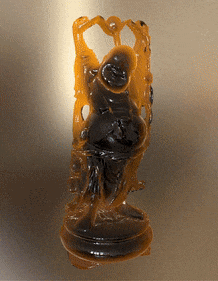

# Unity Spherical Harmonics Translucency

  

# Overview
This is a tool that takes a mesh and foreach vertex saves the thickness in any viewing direction projecting it on  the spherical harmonics basis.
> To compute the thickness the object must have a material with the shader `Translucency/Thickness`. Use the Window/ThicknessCompute to process an object

To create a shader, once you have the 9 coefficients and the fragment view ray, just reconstruct the thickness with the dot between the coefficients and the basis and use it to compute the absorbtion, for example, with a function like `exp(-t)`

## License
This project is licensed under the MIT License - see the [LICENSE](LICENSE)
